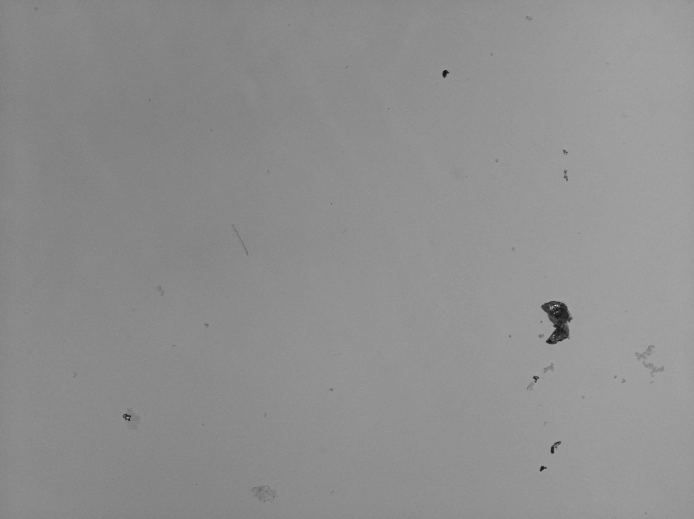
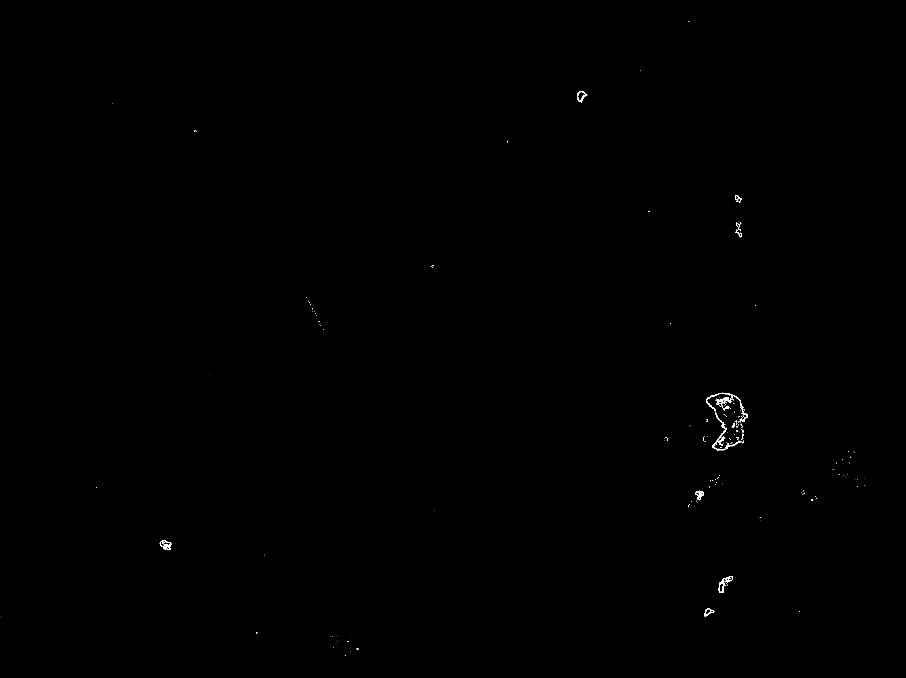
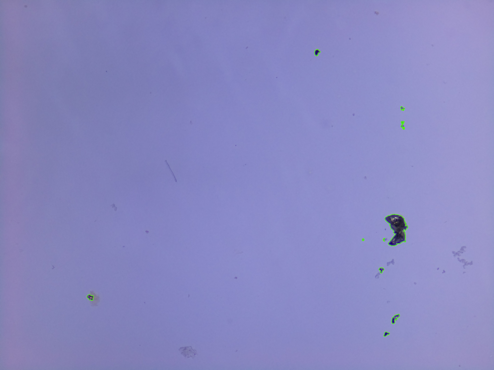

# Detector of Microplastics and Other Particles in Water

This program is designed for the detection of microparticles in water samples taken with a microscope. This is made possible by the BTM (Border-Type-Material) algorithm, which can analyze the edge of different types of materials based on their thickness and sharpness. This is achieved by setting three parameters: the first is the margin, which defines the type of edge. It is the grayscale value that must change between a central pixel and its adjacent one to be considered an edge. The other two parameters are equivalent to a threshold (maximum and minimum) that establish the number of consecutive pixels that must have a value higher than the margin to be considered the edge of the target microparticle.

## How to Run the Program

To run the program, execute the file `btm_program.exe`. The menu presents three options:

1. **Identify Particle**: Select the image to be analyzed along with the type of particle you intend to search for. The particle types are stored in the `particles.txt` file, located in the `files` folder.
2. **Register Material Type**: Register a new type of material.
3. **Modify Material Type**: Modify an existing material type.

## Directory Structure

- **images**: Contains a series of test images for the program.
- **output**: Stores the contours returned by the program, as well as other statistics. This includes three images:
  - The original grayscale image.
  - A binary image with contours analyzed by the algorithm.
  - The original image with highlighted contours.

### Example Output Images

- 
- 
- 

These example images show the different stages of processing: the original grayscale image, the binary image with detected contours, and the final image with highlighted contours.

---

Feel free to contribute to this project or report any issues you encounter.
